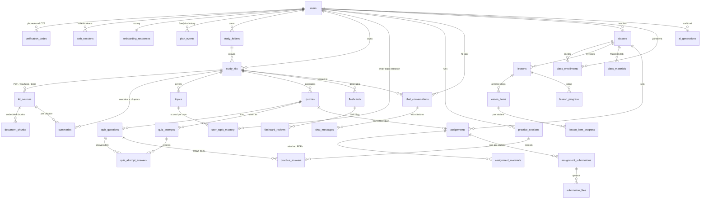

# ReanMate — Database Schema

PostgreSQL 16, raw parameterized SQL, no ORM.
Source of truth: [`server/migrations/001_init.sql`](../server/migrations/001_init.sql)
and [`002_optional_phone.sql`](../server/migrations/002_optional_phone.sql).

**34 tables · 156 indexes · 69 foreign keys (all indexed) · 15 `updated_at` triggers.**

---

## Prerequisites

```sql
CREATE EXTENSION "uuid-ossp";  -- uuid_generate_v4() primary keys
CREATE EXTENSION pg_trgm;      -- Khmer-safe text search
CREATE EXTENSION vector;       -- pgvector, embeddings
```

`uuid-ossp` and `pg_trgm` ship with Postgres. **`vector` does not** — install
[pgvector](https://github.com/pgvector/pgvector) separately, or run Postgres from the
`pgvector/pgvector:pg16` image. `001_init.sql` fails at line 18 without it.

The HNSW index on `document_chunks.embedding` needs pgvector **0.5.0 or newer**.

---

## Conventions

| Rule | Applied as |
|---|---|
| UUID primary keys | `uuid PRIMARY KEY DEFAULT uuid_generate_v4()` |
| All timestamps | `timestamptz`, never `timestamp` |
| Enumerations | `text` + `CHECK (... IN (...))`, not native enums — a new value is a one-line migration with no type rewrite |
| `updated_at` | maintained by the shared `set_updated_at()` trigger, never by application code |
| Foreign keys | every one has a leading-column index |
| JSONB | GIN-indexed wherever it is queried |
| Deletes | `ON DELETE CASCADE` down ownership edges, `SET NULL` for soft references (e.g. a deleted source leaves its flashcards intact) |

### Khmer text search

No `to_tsvector` or `tsquery` appears anywhere in this schema, and none should be added.
Khmer has no word spaces and Postgres ships no Khmer dictionary, so the default tokenizer
treats an entire sentence as a single lexeme. Verified against Postgres directly:

```
to_tsvector('simple', 'មូលដ្ឋានគ្រឹះនៃមូលដ្ឋានទិន្នន័យ')
  -> 'មូលដ្ឋានគ្រឹះនៃមូលដ្ឋានទិន្នន័យ':1        -- one token, not five words

… WHERE to_tsvector(title) @@ plainto_tsquery('ទិន្នន័យ')   -> 0 rows   ✗
… WHERE title % 'ទិន្នន័យ'                                  -> 1 row    ✓
```

Search user-facing text with `pg_trgm` (`%`, `similarity()`, `ILIKE`) against the
`gin_trgm_ops` indexes, or with vector search over `document_chunks`.

---

## ERD



---

## Tables

### Identity, auth, plan — serves `01-auth-onboarding/`, `10-profile/`

| Table | Holds |
|---|---|
| `users` | One account, reachable by email, phone, or both — `users_needs_identifier` (migration 002) requires at least one, and the signup screen treats email as the required field. `role` is null until the student/teacher screen, and current plan state is denormalised here because every gating check reads it. |
| `verification_codes` | Phone and email OTPs. Codes are bcrypt-hashed, never stored raw; `expires_at` + `attempt_count` cap abuse. No Redis — expiry is swept by `cleanup_expired_verification_codes()`. |
| `auth_sessions` | Hashed refresh tokens so an httpOnly-cookie session can actually be revoked. |
| `onboarding_responses` | One row per user. The 3-step survey answers as JSONB (GIN-indexed) plus `survey_version`, because the question set will churn. |
| `plan_events` | Append-only free ⇄ plus history behind the Free/Plus comparison card, including trial start and expiry. |

### Study kits and content — serves `03-study-kits/`, `04-study-mode-summaries/`

| Table | Holds |
|---|---|
| `study_folders` | User-created folders that group kits (`02-create-study-folder`). |
| `study_kits` | A learning space: title, accent colour, `progress_percent`, and the `status` driving the All / In progress / Completed filter. Title is trigram-indexed for "Search your kits". |
| `kit_sources` | Everything a kit was built from — uploaded PDF or photo, YouTube link, or a bare typed topic. `status` (`pending → processing → ready \| failed`) drives the processing screens. |
| `document_chunks` | Retrieval corpus. `vector(1536)` embedding with an HNSW cosine index, plus `page_number` for PDFs and `start_seconds`/`end_seconds` for transcripts so a citation points at the exact spot. |
| `summaries` | One table for the kit overview, a per-source summary, and a numbered chapter (`scope`). Each row carries its own `status`, which is what renders "Ready" vs "Generating" per chapter on `02-five-hour-summary`. |

### Topics and mastery — serves `07-practice/04`, Plus weak-topic detection

| Table | Holds |
|---|---|
| `topics` | Named topics within a kit or class — the granularity "What to review" reports against. |
| `user_topic_mastery` | Rolling per-user, per-topic score. Indexed on `(user_id, mastery_percent)` so "weakest topics" is one ordered scan. |

### Quizzes — serves `06-quiz/`, `09-classes-assignments/03`

| Table | Holds |
|---|---|
| `quizzes` | A quiz owned by a study kit (student-generated) or a class/lesson (teacher-authored); a CHECK requires one of the two. |
| `quiz_questions` | Ordered questions. `options` and `correct_answer` are JSONB so multiple-choice, true/false and written answers share one table. |
| `quiz_attempts` | One sitting: score, `mastery_percent`, and the AI `takeaways` list shown on the results screen. |
| `quiz_attempt_answers` | Per-question response and correctness — the data behind "Review missed questions". |

### Flashcards — serves `08-flashcards/`

| Table | Holds |
|---|---|
| `flashcards` | Term/definition plus SM-2 scheduling (`due_at`, `interval_days`, `ease_factor`, `repetition_count`, `lapse_count`). Scheduling lives on the card because kits are personal; `(user_id, due_at)` is indexed for the "due now" query. |
| `flashcard_reviews` | Append-only review log, so the scheduling algorithm can be retuned and replayed later. |

### Practice — serves `07-practice/`

| Table | Holds |
|---|---|
| `practice_sessions` | One practice or mock-exam run, storing the three setup controls verbatim (`question_count`, `answer_format`, `timer_seconds`; 0 = no timer) plus results and `weak_topics`. |
| `practice_answers` | Per-question record. Keeps a `prompt_snapshot` so a finished session still reads correctly after its source question is edited or deleted. |

### AI tutor — serves `05-ai-tutor-chat/`

| Table | Holds |
|---|---|
| `chat_conversations` | A tutor thread scoped to a study kit or an assignment ("Ask AI about this assignment"). |
| `chat_messages` | Messages with `citations` JSONB — the `Source: Database Week 1.pdf` chips — and a `streaming` status for SSE responses in flight. |

### Classes and assignments — serves `09-classes-assignments/`

| Table | Holds |
|---|---|
| `classes` | A teacher's course: title, `join_code`, `week_count`, description. |
| `class_enrollments` | Who is in a class and in what capacity. Unique on `(class_id, user_id)`. |
| `lessons` | Lessons keyed by `week_number` + `position` — the "Lessons by week" accordion. |
| `lesson_items` | The ordered steps inside a lesson, which is what makes a row read "1 of 3 completed". |
| `lesson_item_progress` | Per-student completion of a single item. Source of truth. |
| `lesson_progress` | Lesson-level rollup so "6 of 12 lessons completed" is one cheap count instead of a nested aggregate. Written by the service when the last item completes. |
| `class_materials` | Files on the Materials tab, optionally attached to a lesson. |
| `assignments` | Title, description, `due_at`, and `instructions` as an ordered JSONB list. Optionally links a `quiz_id` for the question workspace. |
| `assignment_materials` | The attached reference PDFs on the assignment detail screen. |
| `assignment_submissions` | One row per student per assignment: `answers` JSONB, `completed_questions` (drives "0 of 10 questions completed"), score and feedback. |
| `submission_files` | Files uploaded through the assignment upload sheet. |

### Operations

| Table | Holds |
|---|---|
| `ai_generations` | Audit of every call through `server/src/ai/index.js` — mock or real — with request/response JSONB, latency and provider. Makes mock-vs-real output diffable once a key exists. |
| `schema_migrations` | Created by the migration runner, not by `001_init.sql`. Records `version`, a content `checksum`, and `applied_at`; a changed checksum on an applied migration is a hard error. |

---

## Verification status

Applied by the migration runner to an empty database on `pgvector/pgvector:pg16`,
with **nothing stubbed** — both migration files byte-identical to what is committed:

```
[migrate] apply 001_init.sql
[migrate] apply 002_optional_phone.sql
[migrate] applied 2 migration(s)
```

Confirmed against the live database:

- `vector 0.8.6`, `pg_trgm 1.6` and `uuid-ossp 1.1` all installed;
- `document_chunks.embedding` is `vector(1536)` — the real type, not a stand-in;
- `document_chunks_embedding_hnsw` exists with access method `hnsw`;
- 34 tables, 156 indexes, 69 foreign keys, 15 triggers;
- foreign keys lacking a leading-column index: **0**;
- indexes using `tsvector`/`tsquery`: **0**;
- a cosine nearest-neighbour query (`<=>`) returns the self-match at distance 0,
  and the column rejects a wrong-width vector ("expected 1536 dimensions, not 3");
- `users_needs_identifier` rejects an account with neither phone nor email.

### A note on an earlier run

An earlier verification of this schema was done on a local PostgreSQL 18 with no
pgvector, by removing `CREATE EXTENSION vector`, swapping `vector(1536)` for
`real[]`, and dropping the HNSW index. That run reported **155** indexes — one
short, because the stubbed-out HNSW index was exactly the thing missing. The
migration ledger recorded `001_init.sql` as applied while the database did not
contain what the file declares.

That is why CLAUDE.md now forbids stubbing migration statements outright. A
partial apply recorded as complete does not merely fail to verify the schema; it
produces documentation and a ledger that both confidently state something untrue.
